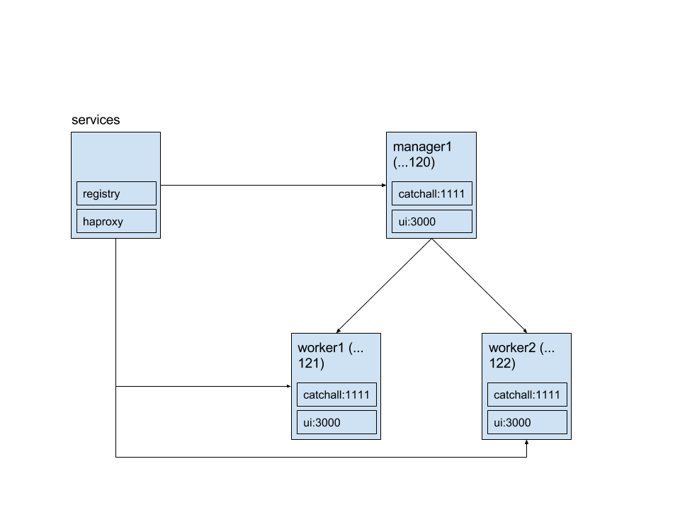

# Docker Swarm Demo

Goal: Get a Docker Swarm up and running in a way that closely mimics Stage/Production environment

vagrant up

open the diagram swarmify.png



show the services environment
```
vagrant ssh services
docker ps
```

login to the swarm manager
```
vagrant ssh manager1
docker node ls
docker service ls
```

Start the visualizer
```
cd /vagrant
./visualizer.sh
```

split screen with visualizer and terminal
http://192.168.77.110:8080

empty nodes
* visualizer is only showing services

deploy the services
```
./deploy.sh
```

breakdown the deploy.sh script

show haproxy catchall
```
curl http://192.168.77.120:1111; echo $'\n';
```

show haproxy ui
```
curl http://192.168.77.120:3000/ui; echo $'\n';
```

update the ui project in atom
```
cd /vagrant/ui
docker build -t registry.swarm.dev:5000/ui:2 .
docker push registry.swarm.dev:5000/ui:2
docker service update --image registry.swarm.dev:5000/ui:2 ui
```

split screen with visualizer and terminal

scale the ui service
```
docker service scale ui=1
curl http://192.168.77.120:3000/ui; echo $'\n';

docker service scale ui=5
curl http://192.168.77.120:3000/ui; echo $'\n';
```

Explore:
* docker compose bundle to create `.dab` file using the experimental features `https://github.com/docker/docker/tree/master/experimental`

Reading
* https://blog.docker.com/2016/06/docker-1-12-built-in-orchestration/
